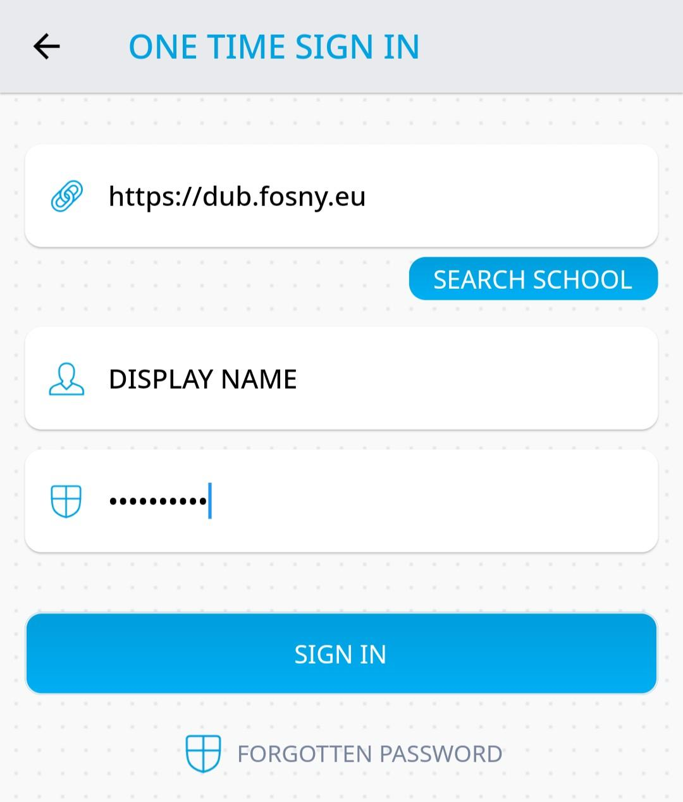
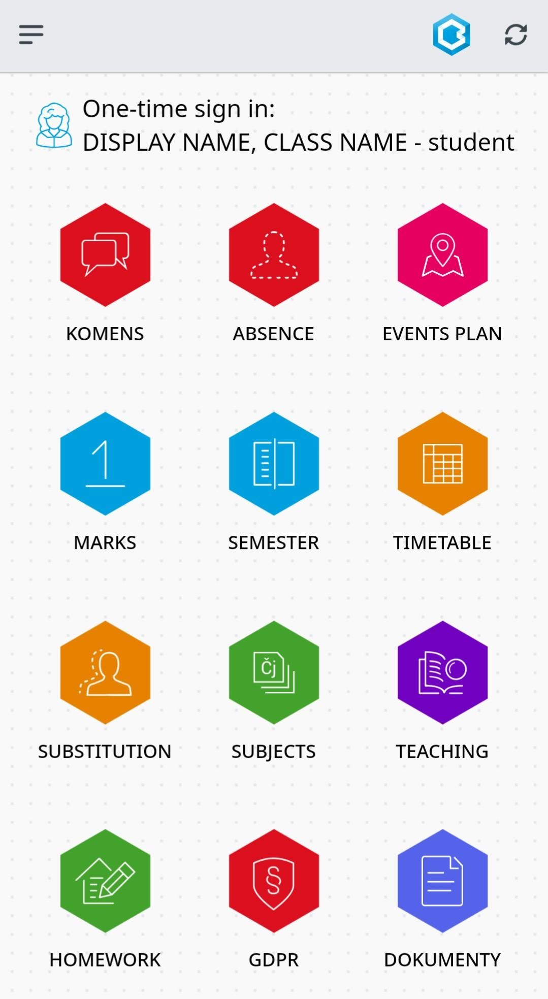

# Dummy Bakaláři 🤖
Bakaláři server for faking authentication in the mobile app Bakaláři Online📱 ([Apple](https://apps.apple.com/us/app/bakal%C3%A1%C5%99i-online/id1459368580), [Google](https://play.google.com/store/apps/details?id=cz.bakalari.mobile), [Aptoide](https://bakalari-online.en.aptoide.com/app)).

## About 🤔
Most companies offering student discounts verify your eligibility by checking if you are authenticated in the Bakaláři Online mobile app. This project is a proof-of-concept implementation of all Bakaláři API endpoints required for the authentication.

## Usage 💻
After installing the official app, you can choose between creating a new profile and using a one-time sign-in option. I recommend using the one-time sign-in option just for testing.

When filing in the information, use the URL of the dummy server as the server name. For example, in the picture below I used my demo server (https://dub.fosny.eu). I also entered "DISPLAY NAME" as username and "CLASS NAME" as the password.



After clicking the "Sign in" button, it will redirect you to the user page with your username as the student's name and password as the student's class.

> NOTE: Clicking on any module except "Dokumenty" will open a blank page saying an error occurred as the dummy server responds with a 400 status code to any unknown request.



To change your student name or class name, if you
- created a profile
  1. Open left sidebar
  2. Click on your student name to get to the "select profile" page
  3. Press the edit button next to your profile
  4. Change your profile name to your needs
- used one-time sign-in: Sign out and log back in with different credentials

## Docker/Podman compose 🚚
An example config file to expose a service at port 8080:

> NOTE: Bakaláři Online requires HTTPS protocol and will fail with plain HTTP or a self-signed certificate. You have to put this service behind a proxy with a valid certificate. (I recommend using Let's Encrypt🔒)

```dockerfile
version: "3"

services:
  dummy-bakalari:
    build: https://gitlab.com/vfosnar/dummy-bakalari.git#main
    restart: always
    environment:
      - "APP_ADDRESS=:80"
    ports:
      - "8080:80"
```
